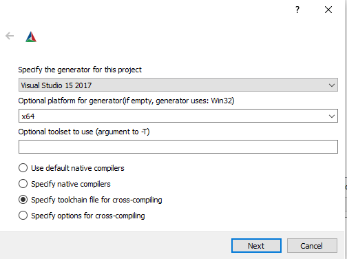

# Library

Before building the library, you need to install and configure Conan, and then use Conan to install the missing libraries.

## Installing Conan

The preferred way to install Conan is from PyPI, the Python Package Index, using the `pip` command.

```bash
pip install conan
```
 In Windows you can use [Chocolatey](https://chocolatey.org/), for example.

## Configuring Conan

Configure Conan in order to generate a default profile. This is stored in a directory called **~/.conan**.

```bash
conan profile new default --detect  # Generates default profile detecting the system compiler
```

In Linux/Ubuntu, you need to tell Conan to use a later version of the **libcxx**, otherwise it will use an older ABI for compatibility reasons.

```bash
conan profile update settings.compiler.libcxx=libstdc++11 default # Sets libcxx to C++11 ABI
```

## Installing Conan packages

Install the missing packages using Conan. This installs the required files into the build directory

```bash
cd library
mkdir build && cd build
conan install ../conan --build=missing -s build_type=Release
```

Unless all of the required packages are found, you might get error messages when installing the Conan packages for the first time. 
In Linux you just need to install the missing packages using the package manager. For example, in Ubuntu `sudo apt-get install <name-of-the-package>`.
When building the project, in any system, the build type of the project must match the `build_type` that was used to install the Conan packages.
What this means in practise is that in CMake, for example, you need to choose `Release` if you installed the Conan package with `-s build_type=Release`.

Conan uses a configuration file called [conanfile.txt](./conan/conanfile.txt) to configure required packages. This is what our file looks like in this case:

```
[requires]
    gtest/1.10.0
    opencv/4.5.3

[generators]
    cmake_find_package_multi

[options]
    opencv:shared=True
```

## Run CMake

Run cmake (preferrably the GUI version), choose the `build` directory (we normally don't want the source and build directory to be the same), and click on **Configure**.
Additionally, in Windows, set the **Optional platform for generator** so that it matches the one in the Conan default profile (e.g. 32/64-bit).

<figure align="center">
    
    <figcaption>Figure 1. CMake settings for Visual Studio.</figcaption>
</figure>

If the configuration phase was completed successfully, set the [cmake_install_prefix](https://cmake.org/cmake/help/latest/variable/CMAKE_INSTALL_PREFIX.html) variable to the directory 
where you want to install the library and click **Configure** again. Later on when we build the executable, we need to tell CMake where we have installed the library. 
By default CMake proposes to install to `/usr/local`, but installing to that location for testing purposes is not recommended, unless you're absolutely certain that you won't 
be overwriting anything important. If everything has been configured correctly, click **Generate** (and **Open Project** if in Windows).

## Building and Installing

Build and install the library by executing the following commands while in the `build` directory:

```bash
make
make install
```

